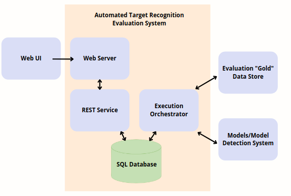

#  mySQL Database for Automated Target Recognition (ATR) Common Evaluation Store  

### By Sam Videlock

Final Project for Designing and Developing Relational and NoSQL Databases (CSCI E59) 

- [Link to Presentation](https://www.canva.com/design/DAE-WG1qk5A/iOBoycNkYgKFXwu4GECifw/view?utm_content=DAE-WG1qk5A&utm_campaign=designshare&utm_medium=link&utm_source=publishpresent)
- [Link to Github Repo](https://github.com/svideloc/csci-e59-sql-final-project)
- [Link to Video]()

## Problem Statement

**Design database for storing data relevant to the detection and evaluation of Automated Target Recognition (ATR) models.**

The client requires a system that can leverage "Gold" datasets to evaluate models from different teams to determine which model is performing best on a common evaluation process.

Data such as what model was used, what dataset was used, truth labels, detections, and image metadata will all need to be stored in a place that can be easily queried, in order to show common evaluation metrics such as Precision/Recall tables for a given model run and identify models that are performing best on a particular dataset.

### Big Picture

A user should be able to select a model & select a dataset and run an Evaluation.

The mySQL database will handle storing all of the information associated with model detection's and evaluations, as well as image and model metadata.




## mySQL Design

See the below diagram to understand the structure of the dataset.


I chose a sql database because of the many foreign key interactions, and likely transactions that will be going on to the database at the same time. Multiple users will be able to access the WEB UI at any given moment, meaning that multiple evaluations can be run with any number of models/datasets. Having this organized into the tables in the design above will prove to be useful as the project scales with more models and datasets.

Let's go through each table, its purpose, and what data it is storing.

### MODELS & DATASETS

*MODELS* and *DATASETS* are two of the simpler tables in the dataset. The *MODELS* table simply captures each model that is available in the evaluation. Similarly the *DATASETS* table shows which datasets are available to inference the evaluation against. Users looking at the UI, will likely see a list of available models and datasets which will be derived from these tables!See the below `SELECT` statement for the kind of data that exists in these two tables:


```
mysql> SELECT * FROM MODELS LIMIT 3;
+----------+-------------+------+----------------------------+
| model_id | type        | name | description                |
+----------+-------------+------+----------------------------+
|        1 | retinaBoats | boat | retina net model for boats |
|        2 | fasterBoats | boat | faster rcnn for boats      |
|        3 | fasterCats  | cats | faster rcnn for cats       |
+----------+-------------+------+----------------------------+
3 rows in set (0.00 sec)

mysql> SELECT * FROM DATASETS LIMIT 3;
+------------+-------------+------+------------------------+
| dataset_id | name        | type | description            |
+------------+-------------+------+------------------------+
|          1 | retinaBoats | boat | gold dataset for boats |
|          2 | cat         | cat  | gold dataset for cats  |
|          3 | dog         | dog  | gold dataset for dogs  |
+------------+-------------+------+------------------------+
3 rows in set (0.00 sec)
```

### IMAGES

*IMAGES* really just refers to the image metadata, for the class example I'm just going to use the `image_id` (which will just be the name of the file for now) and a **FOREIGN KEY** reference to the `dataset_id` from the *DATASETS* table for which an image belongs in. You will notice in the diagram a one to many relationship as one image can actually belong in multiple datasets! See the below image for the kind of data that exists in this table:

```
mysql> SELECT * FROM IMAGES LIMIT 5;
+-----------+------------+
| image_id  | dataset_id |
+-----------+------------+
| 00aa8bc42 |          1 |
| 00c3e1386 |          1 |
| 00c54cf6e |          1 |
| 00ce2c1c0 |          1 |
| 0a09da25f |          1 |
+-----------+------------+
5 rows in set (0.00 sec)
```

### DETECTIONS and TRUTH_LABELS

These two tables show where actual objects are in an image. The *TRUTH_LABELS* table obviously shows where the true objects are in a particular `image_id` (**FOREIGN KEY** reference to the *IMAGES* table). The data you will find will be the `xmin`, `xmax`, `ymin`, `ymax` of where an object is in an image and of course what that object is. The *DETECTIONS* Table is very similar, but it is what the model predicted on an image (**FOREIGN KEY** reference to the *MODELS* table). See the below `SELECT` statement for the kind of data that exists in these two tables:

```
mysql> SELECT * FROM TRUTH_LABELS LIMIT 5;
+--- ---+-----------+---------+---------+---------+---------+-------+
| tl_id | image_id  | xmin    | xmax    | ymin    | ymax    | class |
+-------+-----------+---------+---------+---------+---------+-------+
|     1 | 0a09da25f | 506.000 | 627.000 |  26.000 |  87.000 | boat  |
|     2 | 0a15f8996 | 532.000 | 710.000 |   4.000 |  60.000 | boat  |
|     3 | ff890d001 |  21.000 | 202.000 | 448.000 | 540.000 | boat  |
|     4 | 0b652af9e | 429.000 | 543.000 | 518.000 | 616.000 | boat  |
|     5 | ffc00cde1 | 447.000 | 768.000 | 153.000 | 252.000 | boat  |
+-------+-----------+---------+---------+---------+---------+-------+
5 rows in set (0.00 sec)
```

### EVALUATION

The *EVALUATION* table is a great summary table for how a model performed. It will tell you which model and dataset was used, the time of the evaluation, and the score of the model as well as some other associated metadata. This will be a simple table to query for users looking at the UI, wanting to compare different model runs. See below for the type of data in this table:

```
mysql> SELECT * FROM EVALUATION LIMIT 5;
+---------+----------+------------+--------+-------+----------+------+
| eval_id | model_id | dataset_id | object | score | metric   | IOU  |
+---------+----------+------------+--------+-------+----------+------+
|       1 |        1 |          1 | boat   |  0.94 | AP_SCORE | 0.50 |
|       2 |        1 |          1 | boat   |  0.96 | AP_SCORE | 0.30 |
|       3 |        2 |          1 | boat   |  0.99 | AP_SCORE | 0.50 |
|       4 |        2 |          1 | boat   |  1.00 | AP_SCORE | 0.30 |
|       5 |        4 |          2 | dog    |  0.90 | AP_SCORE | 0.50 |
+---------+----------+------------+--------+-------+----------+------+
5 rows in set (0.00 sec)
```

### RESULTS_METADATA

This table contains the metadata that determined the score in the *EVALUATION* table. It is very useful to view this data ordered by probability of a detection, to view how the precision and recall scores change as our threshold/probability goes down. See below for the type of data that exists in this table:

```
mysql> SELECT * FROM RESULTS_METADATA LIMIT 5;
+----+---------+-------+-------+----------+-----------+-----------+-------+
| id | eval_id | prec  | rec   | true_pos | false_pos | false_neg | prob  |
+----+---------+-------+-------+----------+-----------+-----------+-------+
   1 |       1 | 1.000 | 0.010 |        1 |         0 |       106 | 0.999 |
|  2 |       1 | 1.000 | 0.020 |        2 |         0 |       105 | 0.997 |
|  3 |       1 | 1.000 | 0.030 |        3 |         0 |       104 | 0.996 |
|  4 |       1 | 1.000 | 0.040 |        4 |         0 |       103 | 0.996 |
|  5 |       1 | 1.000 | 0.050 |        5 |         0 |       102 | 0.996 |
+----+---------+-------+-------+----------+-----------+-----------+-------+
5 rows in set (0.00 sec)
```

## Creating Database & Tables

The database was created with the following command:

```sql
CREATE DATABASE atr_eval;
```

View the databse:

```
mysql> show databases;
+--------------------+
| Database           |
+--------------------+
| information_schema |
| atr_eval           |
| mysql              |
| performance_schema |
| sys                |
+--------------------+
5 rows in set (0.21 sec)
```

Use the new database:

```sql
USE atr_eval;
```

See the file [create_tables.sql](create_tables.sql) file for the sql code for creating the tables. Here is an example of creating a table for the *EVALUATION* table:

```sql
CREATE TABLE `EVALUATION` (
  `evaluation_id` INT NOT NULL AUTO_INCREMENT PRIMARY KEY,
  `model_id` INT NOT NULL,
  `dataset_id` INT NOT NULL,
  `timestamp` TIMESTAMP DEFAULT CURRENT_TIMESTAMP,
  `object` VARCHAR(20) NOT NULL,
  `score` DECIMAL(5,2) NOT NULL,
  `metric` VARCHAR(20) NOT NULL,
  `IOU` DECIMAL(3,2) NOT NULL,
  FOREIGN KEY (`model_id`) REFERENCES `MODELS`(`model_id`),
  FOREIGN KEY (`dataset_id`) REFERENCES `DATASETS`(`dataset_id`)
);
```

Show all tables:

```
mysql> show tables;
+--------------------+
| Tables_in_atr_eval |
+--------------------+
| DATASETS           |
| DETECTIONS         |
| EVALUATION         |
| IMAGES             |
| MODELS             |
| RESULTS_METADATA   |
| TRUTH_LABELS       |
+--------------------+
7 rows in set (0.01 sec)
```

## Inserting Data (with Python)

See the file [insert_data.py](insert_data.py) for the python code to insert code efficiently into the mySQL database for my data. Below is quick example of how to use the `mysql.connector` library in python for inserting the image data into the *IMAGES* table for an example.

```py
# import needed libraries
import os
import mysql.connector

# func to get sql query and data
def get_images_metadata(location, dataset_id):

    # read in data
    files = os.listdir(location)
    image_names = [os.path.splitext(f)[0] for f in files]

    # convert to list of tuples
    data = [os.path.splittext(f)[0] for f in image_names]

    # create sql statement
    sql = "INSERT INTO IMAGES (dataset_id, image_id) VALUES (%s, %s)"

    return sql, data

# connect to database
mydb = mysql.connector.connect(host="localhost", user="root",
            password="MYPASSWORD", database="atr_eval")
mycursor = mydb.cursor()

# get sql statemetn and associated metadata
sql, data = get_images_metadata(args.data_path, args.dataset_id)

# insert rows
mycursor.executemany(sql, data)
mydb.commit()
print(mycursor.rowcount, "was inserted.")
```

## Common Queries

### Query 1: Precision Recall

One of the most popular queries to this database will be to look at the results metadata for a specific `evaluation_id`. This will mainly be done to create a very common popular plot called the Precision/Recall or PR Curve. This diagram will typically give users an idea of how well their model is performing and give them a general idea of how to start to compare their model with others. This query will be used to augment helping to create this chart for users based on the data from this query:

```SQL
SELECT prec, rec, prob FROM RESULTS_METADATA WHERE evaluation_id='1' ORDER BY prob DESC LIMIT 30;
```

OUTPUT:

```
+-------+-------+-------+
| prec  | rec   | prob  |
+-------+-------+-------+
| 1.000 | 0.010 | 0.999 |
| 1.000 | 0.020 | 0.997 |
| 1.000 | 0.030 | 0.996 |
| 1.000 | 0.040 | 0.996 |
| 1.000 | 0.050 | 0.996 |
| 1.000 | 0.060 | 0.996 |
| 1.000 | 0.070 | 0.995 |
| 1.000 | 0.070 | 0.995 |
| 1.000 | 0.080 | 0.995 |
| 1.000 | 0.090 | 0.995 |
| 1.000 | 0.100 | 0.994 |
| 1.000 | 0.110 | 0.994 |
| 1.000 | 0.120 | 0.993 |
| 1.000 | 0.130 | 0.991 |
| 1.000 | 0.140 | 0.991 |
| 1.000 | 0.150 | 0.990 |
| 1.000 | 0.160 | 0.990 |
| 1.000 | 0.170 | 0.989 |
| 1.000 | 0.180 | 0.989 |
| 1.000 | 0.190 | 0.988 |
| 1.000 | 0.200 | 0.988 |
| 1.000 | 0.210 | 0.988 |
| 1.000 | 0.210 | 0.987 |
| 1.000 | 0.220 | 0.987 |
| 1.000 | 0.230 | 0.986 |
| 1.000 | 0.240 | 0.984 |
| 1.000 | 0.250 | 0.984 |
| 1.000 | 0.260 | 0.983 |
| 1.000 | 0.270 | 0.983 |
| 1.000 | 0.280 | 0.982 |
+-------+-------+-------+
30 rows in set (0.00 sec)

```

Typically we wouldn't limit the results here, but due to the amount of data we are just looking at the top 30 detections for a model. Perhaps not the best example, but in the above results we have a very confident model (>98% probability for each detection so far) and so far the model has been right every time indicated by the cumulative precision remaining at 100%. Over time that number will drop, and the recall will increase as the number of detections increases for the dataset. Using this query to plot these results on a simple line chart will be very useful.

### Queries 2/3: Comparing Same Image on Different Models

It may be interesting to compare the same image results from two different models, let's find all the detections for a specific image:

```SQL
SELECT model_id,
         image_id,
         xmin,
         xmax,
         ymin,
         ymax,
         predicted_class,
         probability
FROM DETECTIONS
WHERE image_id="0d5cb03ba";
```

OUTPUT:

```
+----+-----------+---------+---------+---------+---------+-------+------+
| id | image_id  | xmin    | xmax    | ymin    | ymax    | class | prob |
+----+-----------+---------+---------+---------+---------+--------------+
|  1 | 0d5cb03ba | 492.000 | 620.000 | 436.000 | 518.000 | boat  | 0.98 |
|  1 | 0d5cb03ba | 209.000 | 325.000 |  25.000 |  73.000 | boat  | 0.97 |
|  2 | 0d5cb03ba | 200.000 | 312.000 |  27.000 |  71.000 | boat  | 0.88 |
+----+-----------+---------+---------+---------+---------+--------------+
3 rows in set (0.00 sec)
```

Interesting, looks like model 1 found two detections with fairly high confidence, and model 2 only found one prediction for this image. Let's also take a look at the truth labels for this image id and try and determine which model is doing better!

```SQL
SELECT * FROM TRUTH_LABELS  WHERE image_id="0d5cb03ba";
```

OUTPUT: 

```
+-------+-----------+---------+---------+---------+---------+-------+
| tl_id | image_id  | xmin    | xmax    | ymin    | ymax    | class |
+-------+-----------+---------+---------+---------+---------+-------+
|    12 | 0d5cb03ba | 207.000 | 330.000 |  24.000 |  75.000 | boat  |
|    13 | 0d5cb03ba | 494.000 | 620.000 | 440.000 | 521.000 | boat  |
+-------+-----------+---------+---------+---------+---------+-------+
2 rows in set (0.00 sec)
```

Looks like there were two boats the image `0d5cb03ba` and that `model_id = 1` is finding them a bit better then the second model!

### Query 4: How Many Images are in Each Dataset?

Let's take a look at the tables `DATASETS` & `IMAGES` and count the number of images in each of the datasets. We will need to perform a left join here:

```SQL
SELECT img.dataset_id, count(*) AS count_images, ds.name, ds.type, ds.description FROM IMAGES img
LEFT JOIN DATASETS ds
    ON (ds.dataset_id = img.dataset_id)
GROUP BY  img.dataset_id;
```

OUTPUT:

```
+------------+--------------+-------------+------+------------------------+
| dataset_id | count_images | name        | type | description            |
+------------+--------------+-------------+------+------------------------+
|          1 |          124 | retinaBoats | boat | gold dataset for boats |
|          2 |          115 | cat         | cat  | gold dataset for cats  |
|          3 |          105 | dog         | dog  | gold dataset for dogs  |
+------------+--------------+-------------+------+------------------------+
3 rows in set (0.00 sec)
```

From the above output you can see that the boat dataset contains the most images at 124, followed by cats with 115 and dogs with 105.

### Query 5: Compare Model Scores at Different Intersection Over Union (IoU) Thresholds

Another table that users will be interested in is seeing how models perform at different IoU thresholds. This will help the user determine what IoU to use when applying their models to production systems.

```SQL
SELECT * FROM EVALUATION WHERE model_id=1;
```

OUTPUT:

```
+---------+----------+------------+--------+-------+----------+------+
| eval_id | model_id | dataset_id | object | score | metric   | IOU  |
+---------+----------+------------+--------+-------+----------+------+
|       1 |        1 |          1 | boat   |  0.94 | AP_SCORE | 0.50 |
|       2 |        1 |          1 | boat   |  0.96 | AP_SCORE | 0.30 |
+---------+----------+------------+--------+-------+----------+------+
2 rows in set (0.00 sec)
```

The above results may lead a user to use a the lower IoU threshold of 0.3 since the score was slightly higher. A bit more anlysis may need to be done before making this decision, but this summary table can be a helpful starting place.

## Conclusion & Next Steps

Overall, this project has been a great starting place for my work project, there will be a couple more tables that will need to be added in order to support the UI components as well as a few more model tables such as cleaning up the Models table and adding another table called `OBJECTS` perhaps which will list all of the objects that a specific `model_id` detects.

As far as scaling of the database goes, there will mainly be two tables that could grow very rapidly, that would be the `DETECTIONS` table and the `RESULTS_METADATA` tables. The other tables will grow, but at a fairly small pace. In order to keep the data controlled in the two tables that will grow quickly we will have an aging off of data to be specified in the future, this can also be controlled perhaps by last queried date instead of date of ingest which we can add into the tables as well. 

In summary, this report should have shown what the design and purpose of the mySQL database was, how to create the database/tables and populate and query data from the database.

**NOTE: Some output tables have been modified to be slightly smaller to fit when converting from markdown to PDF**
