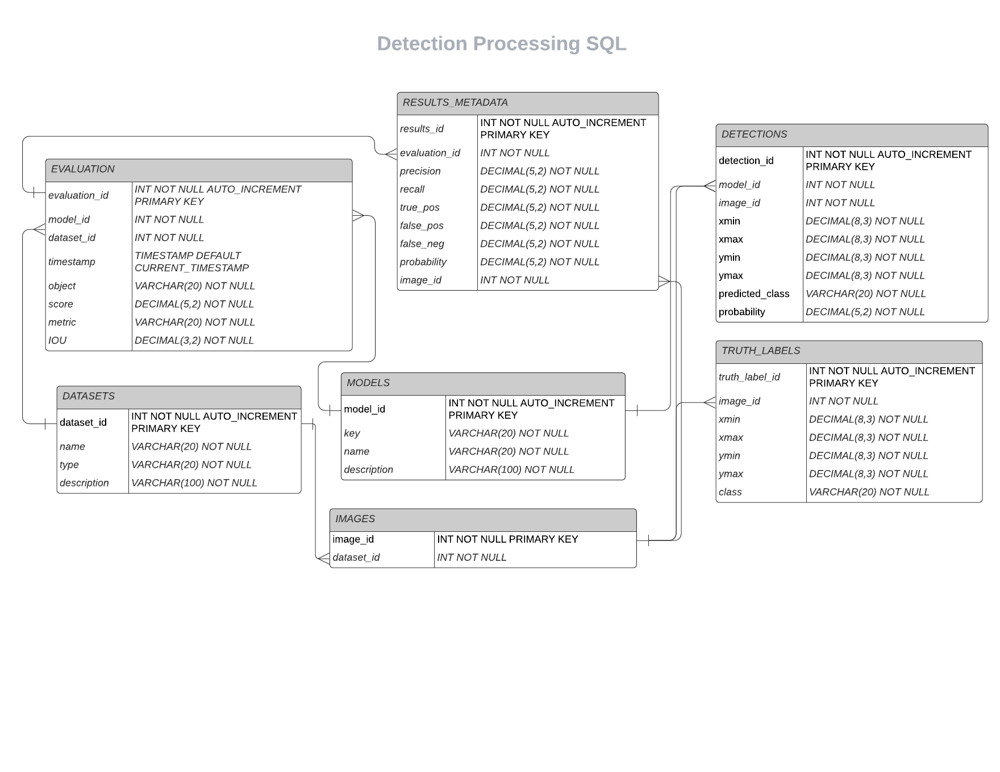

# mySQL Database for Automated Target Recognition (ATR) Common Evaulation Store

Final Project for Designing and Developing Relational and NoSQL Databases (CSCI E59)

[Link to Presentation](https://www.canva.com/design/DAE-WG1qk5A/iOBoycNkYgKFXwu4GECifw/view?utm_content=DAE-WG1qk5A&utm_campaign=designshare&utm_medium=link&utm_source=publishpresent)

## Problem Statement

**Design database for storing data relevant to the detection and evaluation of Automated Target Recognition (ATR) models.**

The client requires that the system that can leverage "Gold" datasets to evaluate models from different teams to determine which model is performing best on a common evaluation process.

Data such as what model was used, what dateset was used, truth labels, detections, and image metadata will all need to be stored in a place that can be easily queried, in order to show common evaluation metrics such as Precision/Recall tables for a given model run
Identify models that are performing best on a particular dataset

## mySQL Design

See the below diagram to understand the structure of the dataset.

## Creating Tables

See the file `create_tables.sql` for the sql code for creating the tables.

## Inserting Data (with Python)

See the file `insert_data.py` for the python code to insert code into the `images`, `detection`, `results_metadata`, and `truth_labels` tables.

## Common Queries
