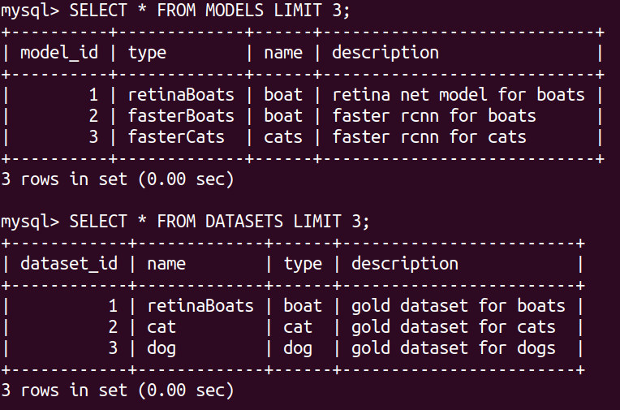
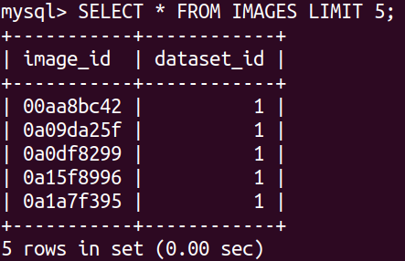
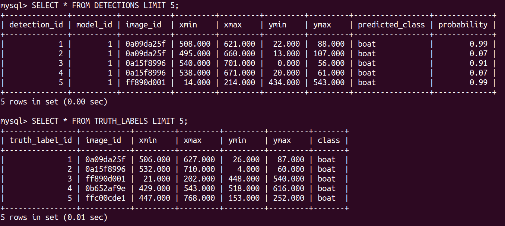
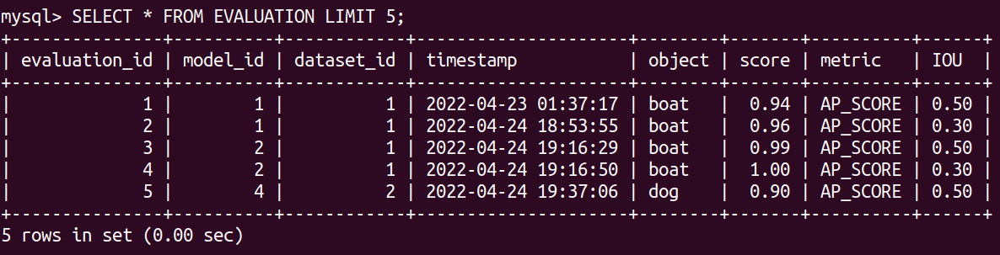
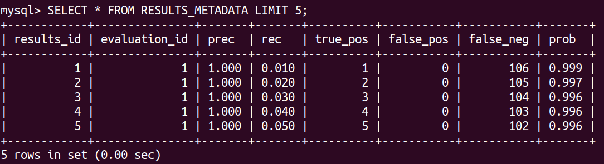
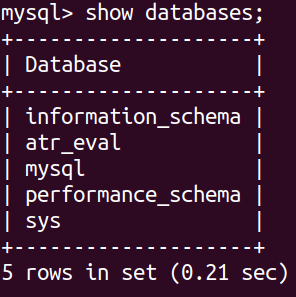
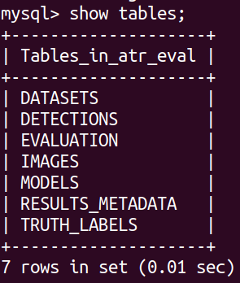

# mySQL Database for Automated Target Recognition (ATR) Common Evaulation Store

Final Project for Designing and Developing Relational and NoSQL Databases (CSCI E59)

[Link to Presentation](https://www.canva.com/design/DAE-WG1qk5A/iOBoycNkYgKFXwu4GECifw/view?utm_content=DAE-WG1qk5A&utm_campaign=designshare&utm_medium=link&utm_source=publishpresent)

## Problem Statement

**Design database for storing data relevant to the detection and evaluation of Automated Target Recognition (ATR) models.**

The client requires that the system that can leverage "Gold" datasets to evaluate models from different teams to determine which model is performing best on a common evaluation process.

Data such as what model was used, what dateset was used, truth labels, detections, and image metadata will all need to be stored in a place that can be easily queried, in order to show common evaluation metrics such as Precision/Recall tables for a given model run and identify models that are performing best on a particular dataset.

## mySQL Design

See the below diagram to understand the structure of the dataset.


I chose a sql database because of the many foreign key interactions, and likely transactions that will be going on to the database at the same time. Multiple users will be able to access the WEB UI at any given moment, meaning that multiple evalations can be run with any number of models/datasets. Having this organized into the tables in the design above will prove to be useful as the project scales with more models and datasets.

Let's go through each table, its purpose, and what data it is storing.

### MODELS & DATASETS

*MODELS* and *DATASETS* are two of the simpler tables in the dataset. The *MODELS* table simply captures each model that is available in the evaluation. Similarly the *DATASETS* table shows which datasets are available to inference the evaluation against. Users looking at the UI, will likely see a list of available models and datasets which will be derived from these tables!See the below `SELECT` statement for the kind of data that exists in these two tables:




### IMAGES

*IMAGES* really just refers to the image metadata, for the class example I'm just going to use the `image_id` (which will just be the name of the file for now) and a **FOREIGN KEY** reference to the `dataset_id` from the *DATASETS* table for which an image belongs in. You will notice in the diagram a one to many relationship as one image can actually belong in multiple datasets! See the below image for the kind of data that exists in this table:




### DETECTIONS and TRUTH_LABELS

These two tables show where actual objects are in an image. The *TRUTH_LABELS* table obviously shows where the true objects are in a particular `image_id` (**FOREIGN KEY** reference to the *IMAGES* table). The data you will find will be the `xmin`, `xmax`, `ymin`, `ymax` of where an object is in an image and of course what that object is. The *DETECTIONS* Table is very similar, but it is what the model predicted on an image (**FOREIGN KEY** reference to the *MODELS* table). See the below `SELECT` statement for the kind of data that exists in these two tables:



### EVALUATION

The *EVALUATION* table is a great summary table for how a model performed. It will tell you which model and dataset was used, the time of the evaluation, and the score of the model as well as some other associated metadata. This will be a simple table to query for users looking at the UI, wanting to compare different model runs. See below for the type of data in this table:



### RESULTS_METADATA

This table contians the metadata that determined the score in the *EVALUATION* table. It is very useful to view this data ordered by probability of a detection, to view how the precision and recall scores change as our threshold/probability goes down. See below for the type of data that exists in this table:



## Creating Tables & Database

The database was created with the following command:

```sql
CREATE DATABASE atr_eval;
```



See the file [create_tables.sql](create_tables.sql) file for the sql code for creating the tables. Here is an example of creating a table for the *EVALUATION* table:

```sql
CREATE TABLE `EVALUATION` (
  `evaluation_id` INT NOT NULL AUTO_INCREMENT PRIMARY KEY,
  `model_id` INT NOT NULL,
  `dataset_id` INT NOT NULL,
  `timestamp` TIMESTAMP DEFAULT CURRENT_TIMESTAMP,
  `object` VARCHAR(20) NOT NULL,
  `score` DECIMAL(5,2) NOT NULL,
  `metric` VARCHAR(20) NOT NULL,
  `IOU` DECIMAL(3,2) NOT NULL,
  FOREIGN KEY (`model_id`) REFERENCES `MODELS`(`model_id`),
  FOREIGN KEY (`dataset_id`) REFERENCES `DATASETS`(`dataset_id`)
);
```



## Inserting Data (with Python)

See the file [insert_data.py](insert_data.py) for the python code to insert code efficiently into the mySQL database for my data. Below is quick example of how to use the `mysql.connector` library in python for inserting the image data into the *IMAGES* table for an example.

```py
# import needed libraries
import os
import mysql.connector

# func to get sql query and data
def get_images_metadata(location, dataset_id):

    # read in data
    files = os.listdir(location)
    image_names = [os.path.splitext(f)[0] for f in files]

    # convert to list of tuples
    data = [os.path.splittext(f)[0] for f in image_names]

    # create sql statement
    sql = "INSERT INTO IMAGES (dataset_id, image_id) VALUES (%s, %s)"

    return sql, data

# connect to database
mydb = mysql.connector.connect(host="localhost", user="root",
            password="MYPASSWORD", database="atr_eval")
mycursor = mydb.cursor()

# get sql statemetn and associated metadata
sql, data = get_images_metadata(args.data_path, args.dataset_id)

# insert rows
mycursor.executemany(sql, data)
mydb.commit()
print(mycursor.rowcount, "was inserted.")
```

## Common Queries
